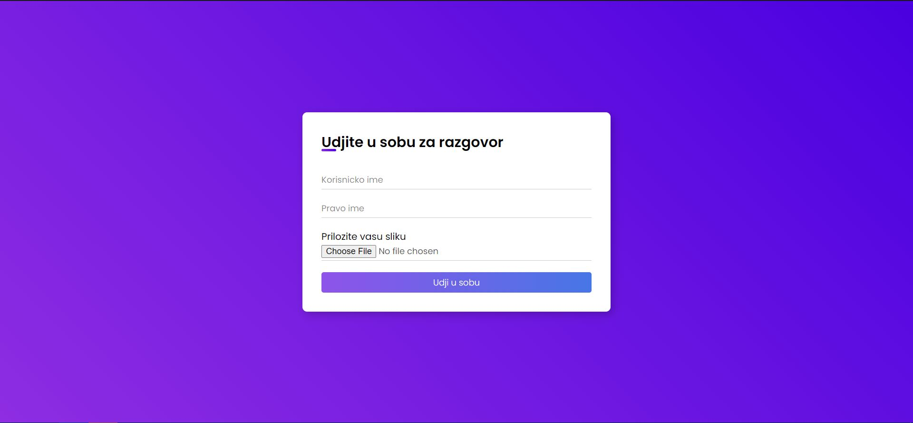
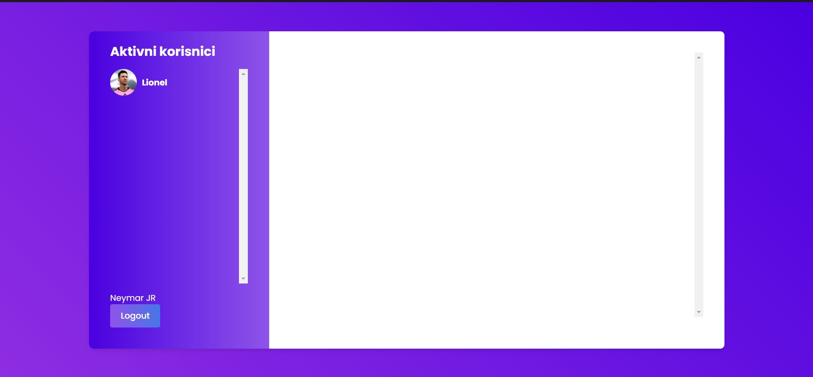
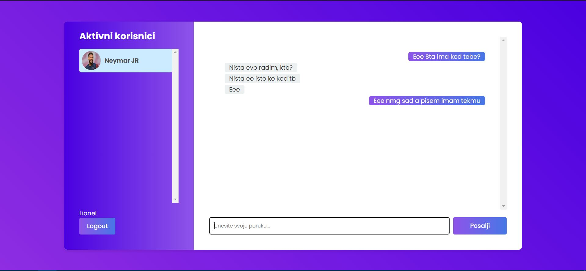

Chat Application
This is a real-time chat application built with Spring Boot, JavaScript, WebSockets, and STOMP.
It enables users to send and receive messages, manage their online status, and retrieve chat histories. 
The application features a modern design with cool CSS styling, enhancing the overall user experience.

Key Features:
Real-Time Messaging: Users can communicate instantly via WebSockets.
User Status Management: Tracks user connection and disconnection states.
Chat History: Retrieves previous conversations between users.
Chat Rooms: Dynamically created chat rooms for user conversations.
Sleek and Cool CSS: The interface is designed with modern CSS, including responsive layouts, smooth animations, and an intuitive design for both the chat interface and user management sections.

Backend Implementation:

RazgovorSobaService:
- Creating Chat Rooms: The kreirajIdRazgovora method generates a unique chat room ID based on the sender and recipient. The format is sender_recipient (e.g., mihajlo_marko).
- Fetching Chat Room ID: The getRazgovorSobaID method retrieves the chat room ID between two users. If the room doesn't exist and the flag kreirajNovuAkoNePostoji is set to true, a new room will be created.

KorisnikServis and RazgovorService:
- User and Message Management: KorisnikServis handles user states, while RazgovorService manages chat history and message persistence.

Technologies:
Frontend: JavaScript (ES6), WebSockets for real-time communication.
Backend: Spring Boot with REST and WebSocket APIs.
CSS Styling: The application features well-designed CSS for a sleek and visually appealing interface.

## Screenshots

### Capture 1

### Capture 2

### Capture 3

